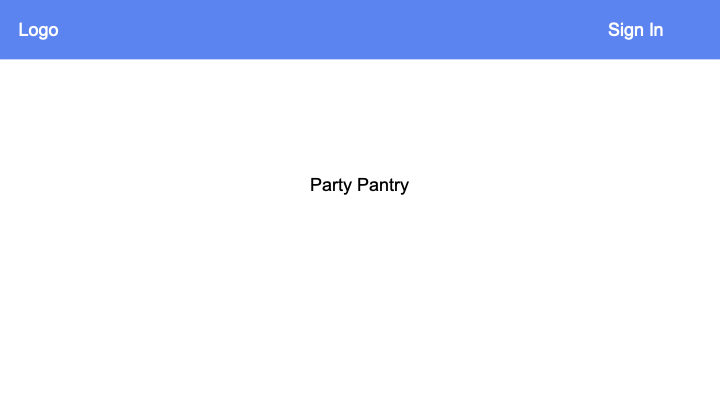

<!-- -->

## Table of Contents 
- [Overview](#overview)
- [User Guide](#user-guide)
- [Team Contract](#team-contract)

## Overview

Party Pantry is a web application that allows users to keep track and update current items in their kitchen. Party Pantry allows users to add 'Storage Spaces', where they can then add any corresponding items.

## User Guide

### Sign up Page

Here you can sign up and create an account to start using Party Pantry!

### Sign in Page

Here you can sign in to your Party Pantry account.

### 'My Kitchen' Page

Once you sign up or sign in, you will be brought to the 'My Kitchen' page, where you can see an overview of your kitchen - you will see all of your storage spaces and items.

### Shopping List

Here you can see a generated shopping list - provided are all the items you are out of or running low on. You will also see a total amount of money that is predicted that you will have to spend if you buy all of the items on the shopping list.

## Team Contract

[Link to Team Contract](https://docs.google.com/document/d/1KSa26cDXpafRdDiPp4icix-SGD2Os3aREFr4hk9QkaE/edit?usp=sharing) (will open in Google Docs).

