<!-- -->

# Party Pantry

[View our organization](https://github.com/party-pantry)


## Table of Contents 
- [Overview](#overview)
- [User Guide](#user-guide--page-mockups)
* [Development History](#development-history)
  * [Milestone 1](#milestone-1-identifying-basic-user-needs-user-stories--mockup-page-development)
  * [Milestone 2](#milestone-2-basic-skeleton-of-all-pages-finalize-database-model-user-authentication)
  * [Milestone 3](#milestone-3-improving-functionality-project-organization-and-acceptance-testing)
  <!-- * [Milestone 4](#milestone-4) -->
- [Acceptance Testing](#acceptance-testing)
* [Developer Guide](#developer-guide)
  * [Continuous Integration](#continuous-integration)
- [Team Contract](#team-contract)
- [Team Members](#team-members)


<!-- * [Goals](#goals-of-the-app)
* [Application Design](#application-design)
* [Data Model](#data-model)
* [Flowchart](#application-flowchart) 
* [Developer Guide](#developer-guide)
* [Deployment](#deployment)
* [Continuous Integration](#continuous-integration)
* [Download & Installation](#installation) -->


## Overview

Party Pantry is a web application that serves as an inventory management system of one's pantry in multiple locations (i.e. multiple homes containing one or more freezers, refrigerators, spice racks, etc.) The app allows users to keep track and update current items in their kitchen. Party Pantry allows users to add 'Storage Spaces', where they can then add any corresponding items.

## User Guide / Page Mockups

This section provides a walkthrough of the Party Pantry web app including its user interface and its capabilities.

### Landing Page

Here is the landing page of our Party Pantry app!

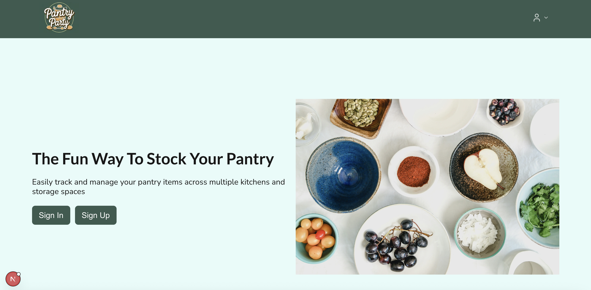
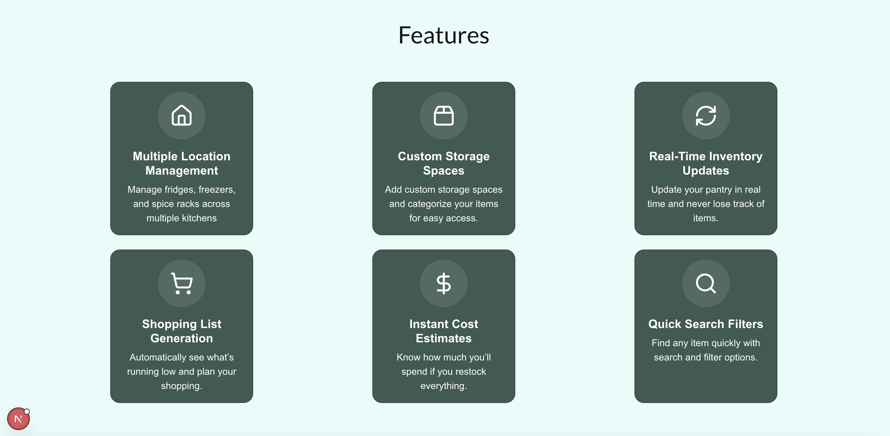

### Sign up Page

Here you can sign up and create an account to start using Party Pantry!

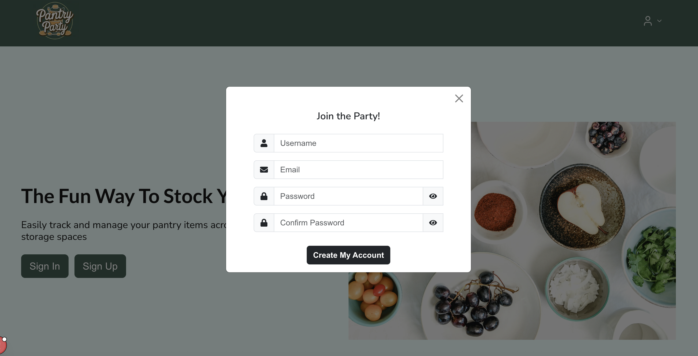

### Sign in Page

Here you can sign in to your Party Pantry account.

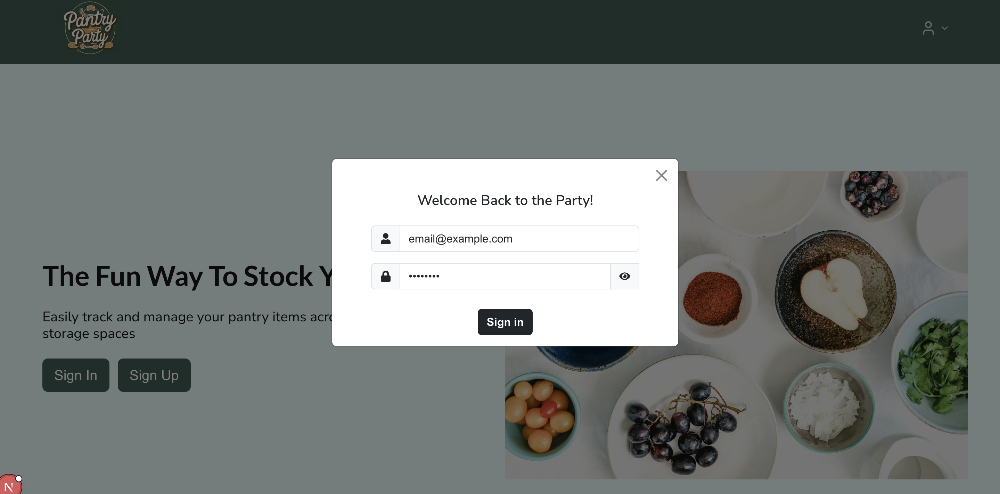

### 'My Kitchen' Page

Once you sign up or sign in, you will be brought to the 'My Kitchen' page, where you can see an overview of your kitchen - you will see all of your storage spaces and items.

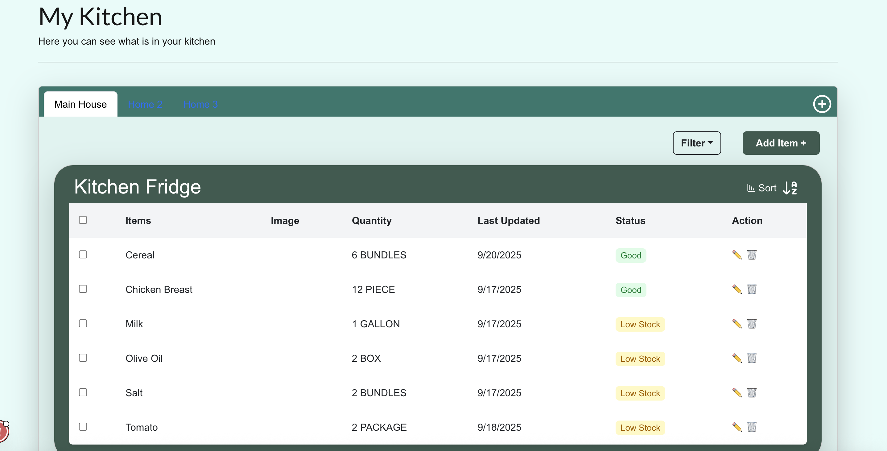

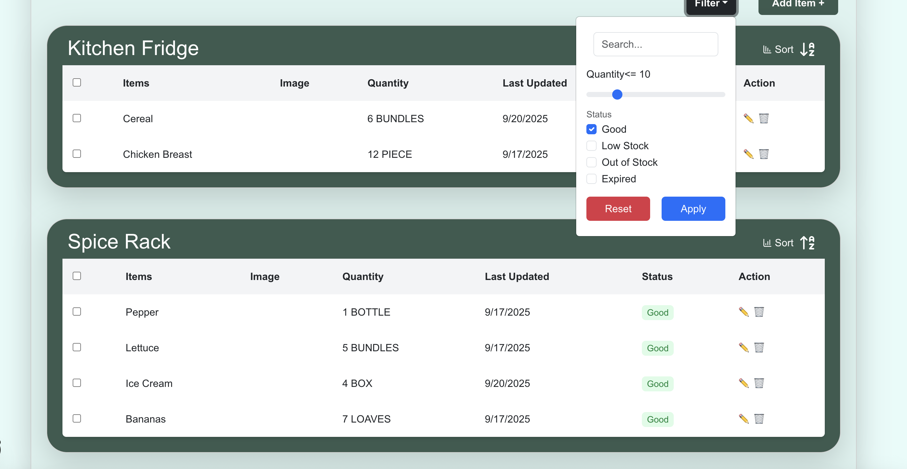


### Shopping List

Here you can see a generated shopping list - provided are all the items you are out of or running low on. You will also see a total amount of money that is predicted that you will have to spend if you buy all of the items on the shopping list.

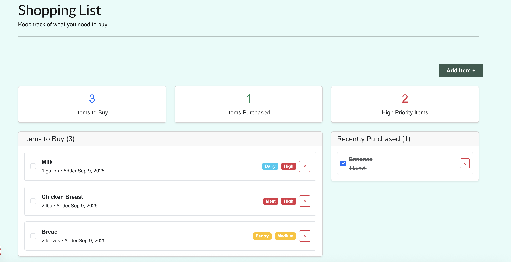
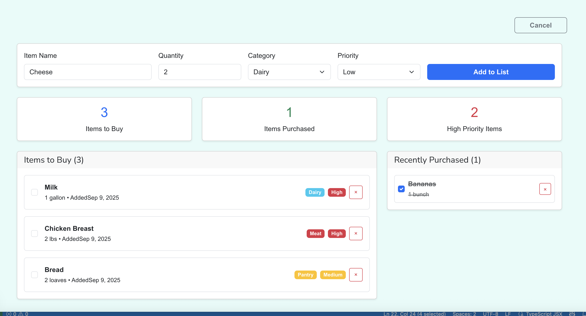

### Recipes Page

This page shows all of the possible recipes you can make with the ingredients you currently have in your pantry. Any ingredients that are missing to make the recipe can be added to your shopping list in the "Shopping List" page. We are planning to add functionality to add in your own custom recipes.

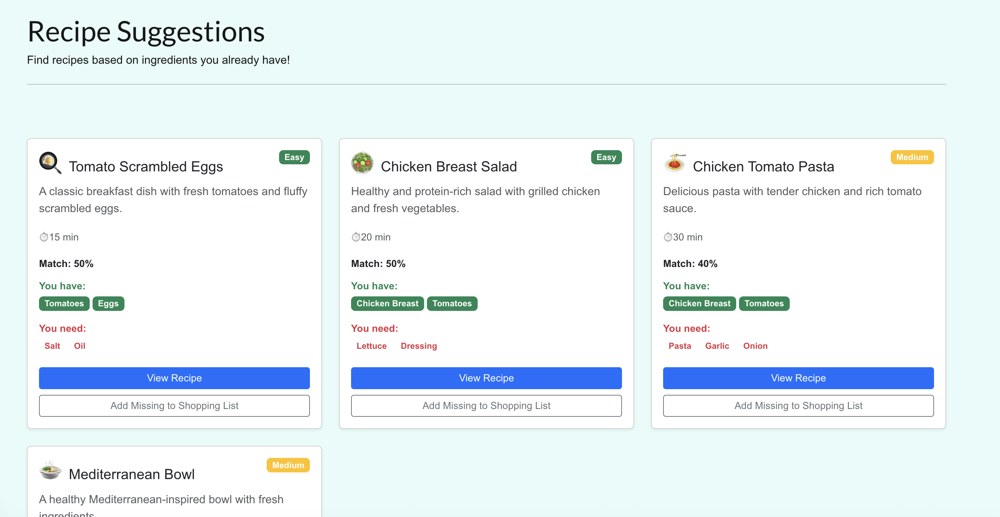

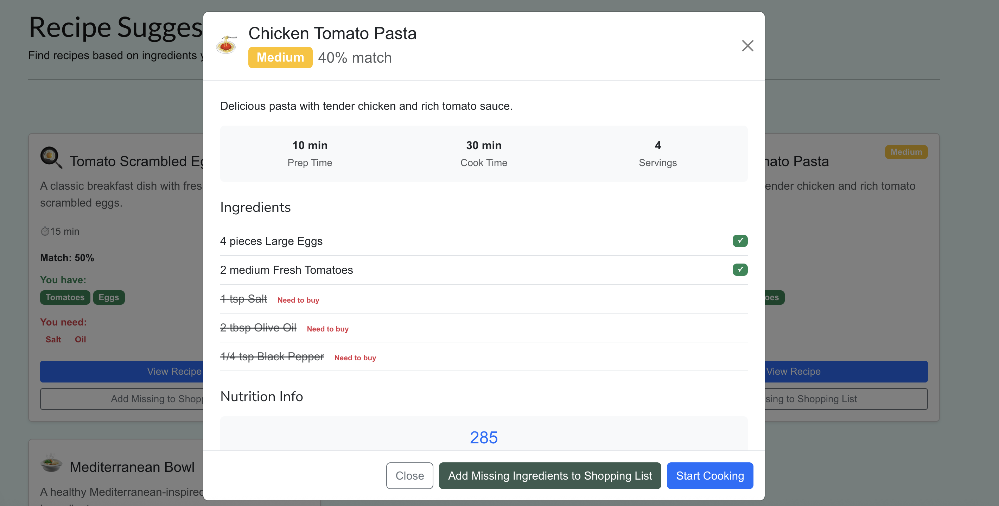


## Development History

The following describes the process of building the app from the design process to code implementation and deployment. Our progress is as follows:

### Milestone 1: Identifying Basic User Needs (User Stories) & Mockup Page Development

The goal of Milestone 1 was to create a work flow for the app to identify its main features to solve the problem of keeping track of supplies and managing ingredient usage. We focused on creating a mockup of the app's UI.

Milestone 1 was managed using [Party Pantry GitHub Project Board M1](https://github.com/orgs/party-pantry/projects/3/views/1)

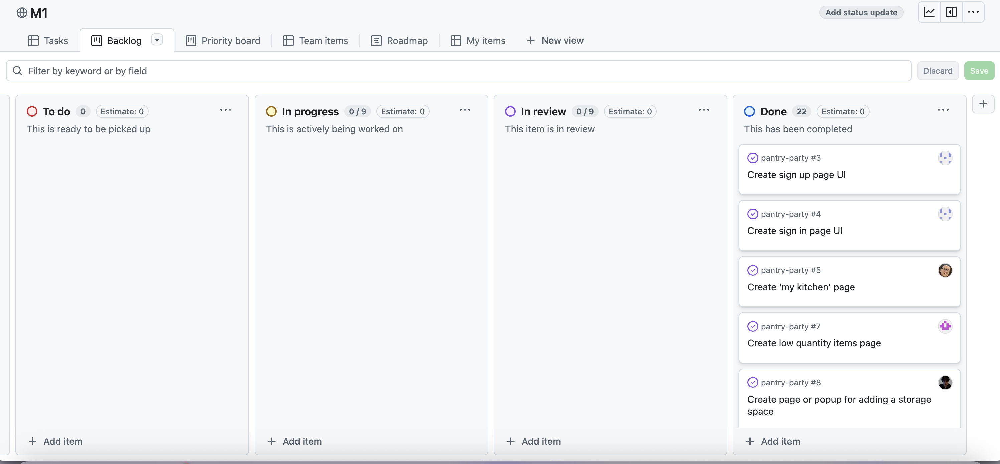

### Milestone 2: Basic Skeleton of All Pages, Finalize Database Model, User Authentication

The goal of Milestone 2 was to create all the basic components of the app. For backend, this included implementing all the relational databases properly and ensuring that functionalities for adding and editing storage spaces/ ingredients work properly. For frontend, we will focus on creating simple layouts for all the webpages and check that all web pages and nav links in the menu bar navigate correctly based on an authenticated user.

Milestone 2 was managed using [Party Pantry GitHub Project Board M2](https://github.com/orgs/party-pantry/projects/5/views/2)

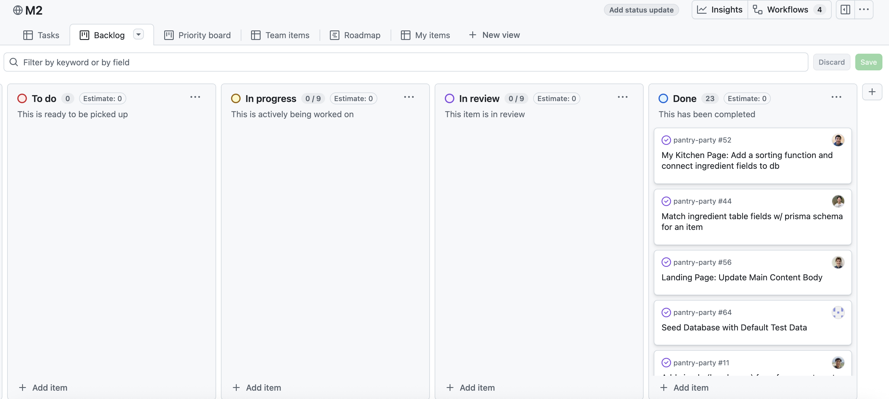


### Milestone 3: Improving Functionality, Project Organization, and Acceptance Testing

The goal of Milestone 3 is to have more functionality and user interactivity with forms and searching features for the My-Kitchen page. Our team is aiming to try to incorporate all data into our database for the Shopping-List and Recipes pages. We will also be continuing with acceptance tests for each of our pages. 

Milestone 3 was managed using [Party Pantry GitHub Project Board M3](https://github.com/orgs/party-pantry/projects/11/views/2)

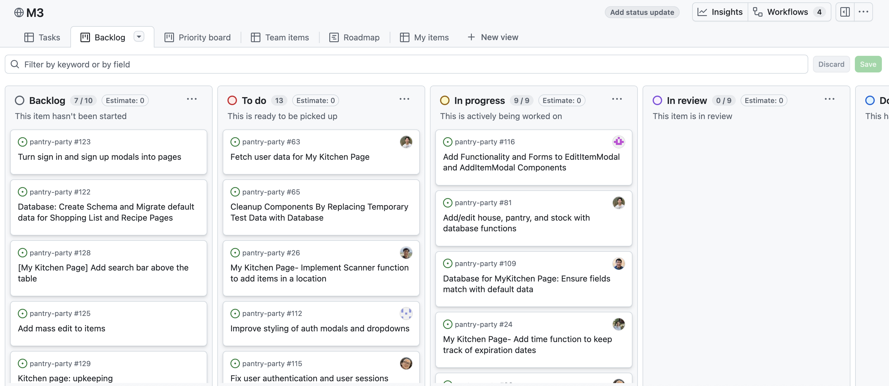

<!--  -->

<!-- 
### Milestone 4: 
### Milestone 5: 
### Milestone 6: 
### Milestone 7: 
### Milestone 8: testing  -->

## Acceptance Testing

The following are screenshots of our basic acceptance testing for Pantry Pantry. We used Playwright to run our acceptance tests:

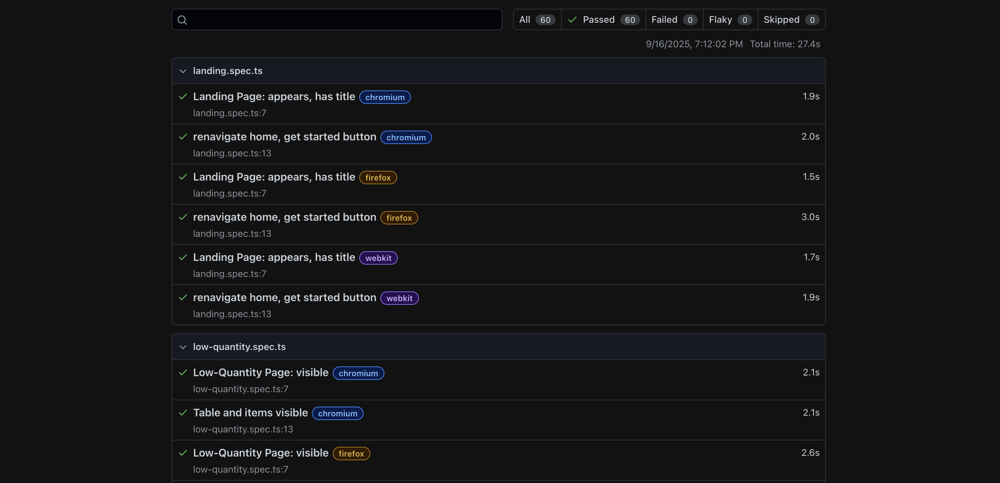
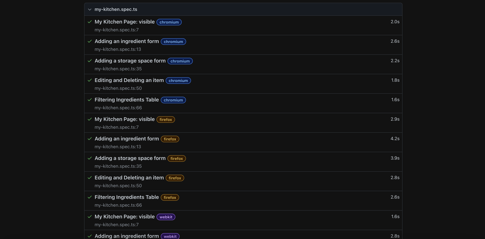
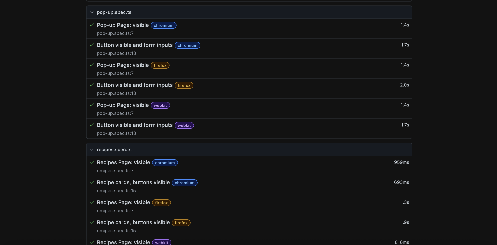
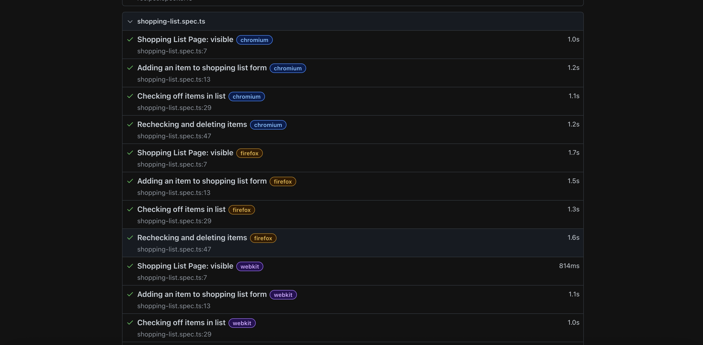
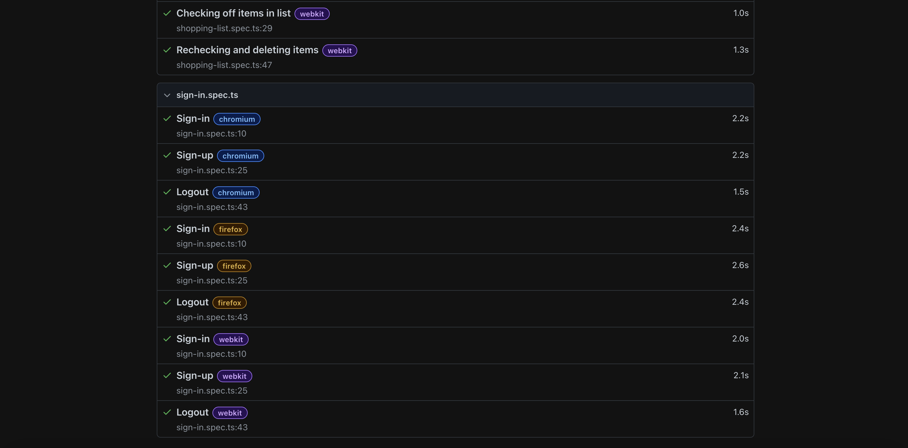


## Developer Guide

### Continuous Integration

[](https://github.com/party-pantry/pantry-party/actions/workflows/ci.yml)

Party Pantry uses [GitHub Actions](https://docs.github.com/en/free-pro-team@latest/actions) to automatically run ESLint and Playwright tests each time a commit is made to the default branch.  You can see the results of all recent "workflows" at [https://github.com/party-pantry/pantry-party/actions](https://github.com/party-pantry/pantry-party/actions).

The workflow definition file is located at 
[.github/workflows/ci.yml](https://github.com/party-pantry/pantry-party/blob/main/.github/workflows/ci.yml).


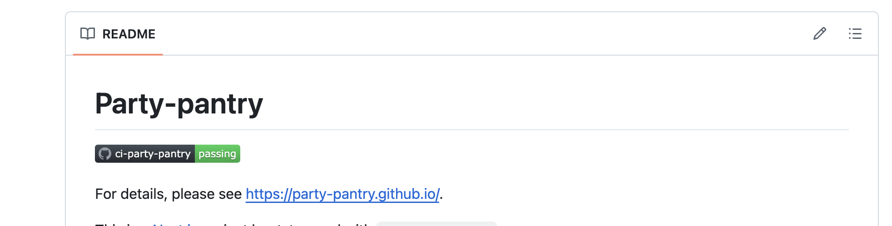

<br>


## Team Contract

[Link to Team Contract](https://docs.google.com/document/d/1KSa26cDXpafRdDiPp4icix-SGD2Os3aREFr4hk9QkaE/edit?usp=sharing) (will open in Google Docs).


## Team Members

Party Pantry is designed and developed by:
* [**Dhaniel Bolosan**](https://github.com/dhanielbolosan) || [View Portfolio](https://dhanielbolosan.github.io/)
* [**Lucas Corriero**](https://github.com/lucascorriero) || [View Portfolio](https://lucascorriero.github.io/)
* [**Jerome Gavin Demesillo**](https://github.com/JeromeDemesillo) || [View Portfolio](https://jeromedemesillo.github.io/)
* [**Yongsheng He**](https://github.com/heyongsh1) || [View Portfolio](https://heyongsh1.github.io/)
* [**Victor Hoang**](https://github.com/hoangv11) || [View Portfolio](https://hoangv11.github.io/)
* [**Abigail Lorber**](https://github.com/abigailLorber) || [View Portfolio](https://github.com/abigailLorber)
* [**Phoung Pham**](https://github.com/phuong808) || [View Portfolio](https://phuong808.github.io/)
* [**Jaren Pinera**](https://github.com/jpinera) || [View Portfolio](https://jpinera.github.io/)
* [**Dat Truong**](https://github.com/DatTruong606) || [View Portfolio](https://dattruong606.github.io/dattruong.github.io/)


<!-- 
## Goals of the app

Our web app aims to provide the following features:

<li>Account registration</li>
<li>Reusable container ownership tracking</li>
<li>Ordering containers from vendors</li>
<li>Distributing containers to vendors from organization</li>
<li>Collateral payments if a container is not returned</li>
<li>QR code scanning and generation</li>
<li>Tracking of returned and non-returned containers</li>


## Application Design

The following describes the design process for our app:

### Data model

The data model for Sustainer consists of two "primary" collections (Accounts and Containers), along with one "join" Collections (ContainersByRole) and one supplemental collection (Credit Card). 

We decided to present the model in this way to easily keep track of the ownership for each container. Here are some reasons for our design:
* The _role_ field has possibilities of user, vendor, or admin, which will indicate the navigation routes of UI pages upon log in. It will also be used to transfer ownership of a container from an admin (organization worker) to a vendor to a user (customer at the event). 
* The CreditCard collection allows us to link a payment method as collateral for the containers that are ordered. In the scenario where they don't return the containers after the event is over, they will be charged accordingly. 
* Multiple containers can be assigned to a single user. The ContainersByRole join collection help us to easily filter the number of containers by a specific user or owner when an admin/moderator wants to check which containers are available and returned. 

Here is an example schematic of the database:


The fields labeled **PK** (Email for Accounts) indicate that this is a unique value so that they can be used as a primary key for that collection. This constraint is enforced in the schema definition associated with that collection. The label **FK** represents the foreign keys that are used from other collections.

### Application Flowchart

 -->


<!-- 

### Milestone 3

The goal of Milestone 3 is to focus on cleaning up the code base, updating UI format, and container ownership transfer. We also focused on implementing the payment portal and payment management. QR code scanning was refined for both the vendor and admin users. 

### Deployment

You can view our deployed app [**here**](https://sustainer.online): [https://sustainer.online](https://sustainer.online)

The following section provides information of interest to Meteor developers wishing to use this code base as a basis for their own development tasks.

<br>


### Installation

First, [install Meteor](https://www.meteor.com/install).

Second, visit the [Sustainer application GitHub page](https://github.com/sus-tainer/sustainer), and click the "Use this template" button to create your own repository initialized with a copy of this application. Alternatively, you can download the sources as a zip file or make a fork of the repo.  However you do it, download a copy of the repo to your local computer.

Third, cd into the _sustainer/app_ directory and install libraries with:

```
$ meteor npm install
```

Fourth, run the system with:

```
$ meteor npm run start
```

If all goes well, the application will appear at [http://localhost:3000](http://localhost:3000).


<br> -->


<!-- 


-->

